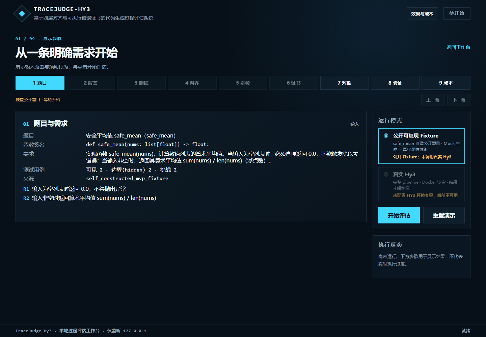
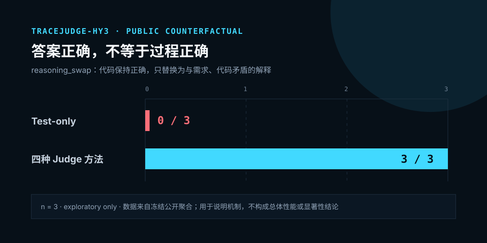
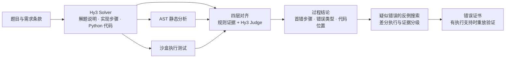

# TraceJudge-Hy3

**基于 Hy3 的代码生成过程评估工作台：检查解题说明与代码是否一致，定位首个可观察的错误步骤，并用执行证据复核判断。**

犀牛鸟开源实战任务 2「可验证场景：过程评估与错误定位」个人／活动作品。项目由参与者独立实现，非腾讯官方发布。

[观看演示](#演示视频) · [启动工作台](#快速体验) · [查看实验发现](#实验发现) · [成果与复现入口](#成果导航)

## 演示视频

从题目与需求出发，展示结构化解答、过程评估、错误定位和证据验证。点击下方 12 秒摘要预览，观看 **74 秒公开 Fixture 演示**。

[](docs/demo/assets/tracejudge_hy3_contest_demo.mp4)

[观看 MP4](docs/demo/assets/tracejudge_hy3_contest_demo.mp4) · [全流程录制脚本](docs/demo/full_flow_storyboard.md)

> 当前视频由公开 Fixture（预置样例）与冻结结果画面生成，未录制实时 Hy3 调用。最终提交用的两分钟内 Hy3 全流程视频待录制；完成后更新此入口。旧视频中的实验状态以本文链接的最新报告为准。

## 一个案例：测试通过，说明与实现却不一致

任务要求 `safe_mean(nums)` 在空列表时返回 `0.0`，在非空列表时返回算术平均值。公开 `reasoning_swap` 案例保留正确代码，只替换解题说明：

| 检查对象 | 案例中的内容 |
| --- | --- |
| 代码实际行为 | 空列表返回 `0.0`；非空列表计算 `sum(nums) / len(nums)` |
| 解题说明声称 | 空列表返回 `1.0`；非空列表取最大值 |
| 功能测试 | 全部通过，代码行为没有改变 |
| 过程评估 | 检出说明与需求、代码的矛盾，并关联相应步骤和证据 |

**测试验证了被执行代码的行为；过程评估进一步检查代码是否实现了它声称的方案。** 这里的“推理”指模型输出的解题说明与实现计划，评估对象是这些可观察内容。



同类 3 条公开构造轨迹中，Test-only 检出 **0/3**，四种 Judge 均检出 **3/3**。这是小样本机制展示，不能据此声称 Full 优于其余 Judge。另一个 `boundary_deletion` 案例删去空输入处理，可展示失败反例与证书重放；两种案例分别说明过程失配和功能失败。[案例与统计依据](docs/releases/phase4/phase3_research_report_public_v1.md)

## 核心设计

系统把需求条款、解答步骤、代码位置与测试结果组织成可检查的关联，再综合规则证据和 Hy3 Judge 的判断。



| 设计选择 | 为什么需要 | 实现方式与验证 |
| --- | --- | --- |
| **四层对齐** | 最终测试无法检查解题说明内部及其与实现之间的矛盾 | 分别检查需求—说明、说明内部、说明—代码、代码—执行证据；通过需求 ID、步骤 ID 和代码行关联。用五方法配对实验检验效果与定位能力 |
| **分级错误证书** | 一次模型判断需要说明依据和可验证程度 | 汇集违反的需求、首错、代码位置、反例与支持证据；公开证书链绑定来源哈希，已有 confirmed 案例完成独立重放 |
| **配对反事实验证** | 既要知道能发现什么，也要知道何时误报 | 固定父题，分别修改说明、代码、边界、捷径或等价实现；同一轨迹交给五种方法，比较检测、定位和误报 |

错误证书按证据强度分级：

- `confirmed_bug`：相关失败已由可执行反例或已执行测试支持。
- `strongly_supported`：有确定性规则证据，尚无独立失败反例。
- `unverified_suspicion`：只有 Judge 疑点，证据不足以确认失败。

首次评估未发现错误时不生成错误证书。错误类型覆盖需求误读、算法与复杂度错误、计划—代码失配、边界与控制流错误及运行异常，定义见[错误类型枚举](src/tracejudge_hy3/schemas/evaluation.py)。规则目前仍是有限启发式，反例搜索也有预算与参数类型限制；设计取舍见[架构说明](docs/architecture.md)和[实现状态](IMPLEMENTATION_STATUS.md)。

## 实验发现

以下分别展示**过程评估器的验证结果**和 **Hy3 在外部任务上的表现**。两类实验的对象、标签和分母不同，分别解释。

### 过程评估：检测与定位各有取舍

固定 **42 条自然轨迹 + 15 条公开反事实 = 57 条轨迹**，比较五种方法，共 **285 个配对判断，283 个有效、2 个 Provider 失败**。

| 方法 | 错误检测准确率 | 首错步骤准确率 | 正确负类上的误报率 |
| --- | --- | --- | --- |
| Test-only | 54/57（94.7%） | 0/11（0.0%） | 0/43（0.00%） |
| Direct LLM Judge | 55/57（96.5%） | 9/11（81.8%） | 1/42（2.38%） |
| Four-layer Structured Judge | **56/57（98.2%）** | 8/11（72.7%） | 1/43（2.33%） |
| Four-layer + AST | 54/57（94.7%） | **10/11（90.9%）** | 2/42（4.76%） |
| Full TraceJudge | 55/57（96.5%） | 9/11（81.8%） | 1/43（2.33%） |

检测准确率使用全 57 条分母，Provider 失败计为错误；误报率为有效二元判断中的 FP/(FP+TN)，故分母可能不同。首错步骤只在有适用金标的 11 条上计分；Test-only 不输出步骤定位，其 0/11 来自统一评分协议。[完整混淆矩阵与口径](docs/releases/phase4/phase4_contest_results_overview_v1.md)

本轮最值得关注的两项发现：

- **最佳检测和最佳定位来自不同方法。** Structured 的检测为 56/57，+AST 的首错步骤为 10/11；Full 没有在全部指标上占优，说明增加证据还需要检验其适用条件。
- **过程审查有收益，也会误伤等价实现。** `reasoning_swap` 中 Judge 发现测试无法识别的说明失配；`equivalent_implementation` 中四种 Judge 均只正确判断 2/3，暴露了误报边界。

这些是探索性结果。自然集的预注册比较未发现 Full 优于 Test-only 或 Direct Judge 的证据；研究仅有 3 个反事实父题，不能据此建立普遍优势或组件因果增益。[研究报告、区间与配对分析](docs/releases/phase4/phase3_research_report_public_v1.md)

### 外部任务：增强测试揭示遗漏，代码判断仍需降低误报

最新汇总版本为 `four-dataset-interim-v1`，结果截至 **2026-09-06 21:40:09（北京时间）**。

| 数据集与任务 | 本轮覆盖 | 主要结果 | 完成状态 |
| --- | --- | --- | --- |
| HumanEval+ · 函数代码生成 | 全量 164 题 | Base+Extra **157/164（95.73%）** | 164/164 有效执行 |
| MBPP+ · 函数代码生成 | 固定 120/378 题 | Base+Extra **95/120（79.17%）** | 预定 120 题完整 |
| LiveCodeBench · 标准输入输出代码生成 | 固定 60 题，各难度 20 题 | **53/60（88.33%）** | 58 题有效执行；2 题 Provider 失败，尚未完整 |
| CodeJudge-Eval v3-A · 给定代码判断 | 正确、错误候选各 60 个 | **Balanced accuracy 90.00%** | 120/120 有效判断 |

- **增强测试额外发现了功能错误。** HumanEval+ 从 Base 的 163/164 降至 Base+Extra 的 157/164，额外发现 **6** 个未通过候选；MBPP+ 从 117/120 降至 95/120，额外发现 **22** 个，其中 2 个为 Extra 官方超时。
- **高检出率仍需要与误报一起看。** CodeJudge v3-A 检出错误程序 **59/60（98.33%）**，同时误报正确程序 **11/60（18.33%）**。后续优化重点包括正确程序误报和细粒度错误归因。

前三组衡量生成代码的功能正确性，CodeJudge 衡量给定代码的 judge-only 判断；这些成绩不直接验证四层首错定位或证书重放，也不合成跨任务平均准确率。LCB 的两题服务失败保留在 60 题主分母中。

<details>
<summary>补充发现：难度分层与错误标签粒度</summary>

LCB 的 Easy／Medium／Hard 分别通过 **20/20、19/20、14/20**；Hard 有效执行 18/20，两题 Provider 失败另列，不能都归为模型答错。

CodeJudge v3-B 使用**同一 50 个候选 × 3 种输出标签粒度**。三组二元判断均为 49/50，原生标签 exact-match 分别为 48/50、42/50、36/50。它们使用不同标签空间，不能视为同一指标的直接排名；这里的 easy/middle/hard 也不代表题目难度。

</details>

[四数据集报告](docs/four_dataset_evaluation_report.md) · [配置、汇总与核验包](docs/evaluation_release/2026-09-06-four-datasets-v1/README.md) · [LCB 难度与失败分析](docs/experiments/lcb60-windows-v2/experiment_report.md)

### 当前版本状态

本文描述 **2026-09-07 当前工作版**；`v0.1.0` 及冻结报告保留各自的历史范围。Web 工作台、完整 HumanEval+ 164 题和 MBPP+ 固定 120 题已有实现或结果，后续工作见文末。

当前四数据集报告、证据包与新增 Demo 改动尚未全部进入 Git 版本记录，对外提交状态待确认。现有工作台已展示历史五方法与成本；最新四数据集报告目前从上述文档入口查看，尚未接入页面实验总览。

## 可信度与成本

### 评估器本身也接受检验

| 核验内容 | 已有证据 | 适用范围 |
| --- | --- | --- |
| 独立人工复标 | 预先冻结的 20/57 子集：`has_error` 一致 20/20，κ=1.000；完整七字段一致 19/20 | 一条分歧另行共识裁决，保留原始统计；不代表全部 57 条均经双人复标 |
| Judge 重复判断 | 四个公开案例各评审 5 次，20/20 有效；错误存在与错误类型原始成对一致率均为 100%，首错步骤为 **90%** | 描述四案例运行内稳定性；事后别名规范化不覆盖原始 90%，一致率不等于正确率 |
| 公开证书重放 | `safe_mean` confirmed 证书成功复现失败，执行证据哈希匹配 | 验证该公开案例的证据链；不代表全部研究样本的证书均已重放 |

[人工复标与裁决](docs/releases/phase4/phase4_p1_post_adjudication_sensitivity_v1.md) · [Judge 稳定性](docs/releases/phase4/phase4_judge_stability_sensitivity_v1.md) · [公开重放记录](docs/releases/phase4/phase4_public_replay_receipt_v1.json)

公开包可核查汇总、配置与来源身份；仅有来源哈希不足以独立重现未公开的原始实验。冻结主研究继续保留 `ANALYZED / CAUTION / CANNOT_VERIFY` 的验证、置信与复现状态。

### 单条样本明细与方法成本对照

工作台的“效果与成本”区域同时提供：

- **本次样本**：逐次记录输入／输出 token、模型请求耗时、调用与重试；按 Solver 生成和 Judge 评审分开汇总，另列包含测试、反例与重放的评测总耗时。
- **历史方法对照**：把冻结研究的检测效果和 Judge 开销放在一起，便于判断增加评估步骤的收益与代价。
- **可导出记录**：逐次用量保存在 `artifacts/demo_costs/<sample_id>.jsonl`，并随 Demo 结果 JSON 导出。API 未返回的 usage 标为缺失，并保留已知用量和覆盖数。

<details>
<summary>展开五种方法的历史效果与成本</summary>

| 方法 | 检测正确数 | 已知输入／输出 token | usage 覆盖轨迹 | 请求／JSON 修复次数 | 累计耗时（秒） |
| --- | --- | --- | --- | --- | --- |
| Test-only | 54/57 | 0／0 | 无模型请求 | 0／0 | 0.0 |
| Direct LLM Judge | 55/57 | 130,459／124,037 | 56/57 | 57／0 | 1,281.4 |
| Four-layer Structured Judge | 56/57 | 137,420／134,436 | 57/57 | 58／1 | 1,429.4 |
| Four-layer + AST | 54/57 | 144,942／129,709 | 56/57 | 57／0 | 1,268.5 |
| Full TraceJudge | 55/57 | 169,300／145,578 | 57/57 | 58／1 | 1,442.9 |

来源为[冻结研究报告](docs/releases/phase4/phase3_research_report_public_v1.md)。历史表不包含共享 Solver 生成开销；耗时是逐配对累计，不能当作整场实验墙钟时间。Test-only 复用既有执行结果，其 0 不表示测试免费。Token 为已知 usage 之和，缺失没有补零；报告未提供金额成本。

</details>

## 快速体验

需要 **Python 3.11+**。真实 Hy3 模式还需要 Docker；公开 Fixture 使用 Mock 生成和实际本地评估链路，无需 API Key。

### Windows / PowerShell

首次安装：

```powershell
python -m venv .venv
.\.venv\Scripts\python.exe -m pip install -e ".[dev]"
```

离线预演：

```powershell
.\scripts\run_recording_demo.ps1 -Offline
```

调用真实 Hy3：在项目根目录的 `.env` 中配置 `HY3_BASE_URL`、`HY3_API_KEY` 和 `HY3_MODEL`，然后运行：

```powershell
.\scripts\run_recording_demo.ps1
```

启动器会检查并按需启动已安装的 Docker Desktop；相同模式的可用服务会被复用。切换离线／真实模式时，先在原终端停止服务，或通过 `-Port 8766` 使用另一端口。

### macOS / Linux

```bash
python3 -m venv .venv
.venv/bin/python -m pip install -e ".[dev]"
./scripts/run_demo.sh
```

未配置 Hy3 时可直接使用公开 Fixture。真实模式需先配置根目录 `.env` 并启动 Docker 引擎。完整配置模板见 [.env.example](.env.example)。

### 本地过程评估工作台

启动后打开 [工作台](http://127.0.0.1:8765/) 或 [全流程录制视图](http://127.0.0.1:8765/?recording=1)。只有点击“开始评估”后才运行流水线。

1. 选择公开 Fixture 或已就绪的真实 Hy3，查看预置题目与需求。
2. 运行后依次查看解答、测试、四层对齐、首错与证据；存在适用失败证书时查看重放。
3. 查看“效果与成本”，下载结果 JSON、HTML 报告和可用的错误证书。

录制视图提供八幕主流程及第 9 幕成本；“典型案例”可查看说明失配、边界缺失和等价实现。当前页面保留进程内最近运行，并提供文件导出。

[详细安装、CLI 与实验命令](docs/running_and_development.md) · [完整操作与录制分镜](docs/demo/full_flow_storyboard.md) · [沙盒边界](docs/safety.md)

## 成果导航

| 想深入了解什么 | 对应材料 |
| --- | --- |
| 设计依据、系统结构与错误分类 | [完整设计方案（含历史规划）](TraceJudge-Hy3：基于四层对齐与可执行错误证书的代码生成过程评估系统.md) · [架构](docs/architecture.md) · [数据模型](docs/data_format.md) · [实现状态](IMPLEMENTATION_STATUS.md) |
| 过程评估效果、首错、误报与案例 | [结果总览](docs/releases/phase4/phase4_contest_results_overview_v1.md) · [完整研究报告](docs/releases/phase4/phase3_research_report_public_v1.md) |
| 四个外部数据集的成绩与边界 | [四数据集报告](docs/four_dataset_evaluation_report.md) · [CSV 指标](docs/evaluation_release/2026-09-06-four-datasets-v1/summary.csv) · [机器可读汇总](docs/evaluation_release/2026-09-06-four-datasets-v1/results.json) |
| 难度、错误类型与失败分析 | [主研究难度代理](docs/releases/phase4/phase4_difficulty_proxy_analysis_v1.md) · [LCB 分层与失败](docs/experiments/lcb60-windows-v2/experiment_report.md) · [CodeJudge 错误分析（历史轮次）](docs/codejudge_eval_error_analysis.md) |
| 人工标签是否可靠、Judge 是否稳定 | [标注协议](docs/experiments/phase3_annotation_guide_v1.md) · [复标与裁决](docs/releases/phase4/phase4_p1_post_adjudication_sensitivity_v1.md) · [稳定性分析](docs/releases/phase4/phase4_judge_stability_sensitivity_v1.md) |
| 如何检查来源、复核与重放 | [四数据集核验包](docs/evaluation_release/2026-09-06-four-datasets-v1/README.md) · [阶段四发布索引](docs/releases/phase4/README.md) · [公开 Fixture 重放步骤](docs/releases/phase4/phase4_fixture_demo_v1.md) |
| 演示、视频与样本成本 | [演示素材说明](docs/demo/README.md) · [全流程脚本与成本口径](docs/demo/full_flow_storyboard.md) |
| 运行、开发与历史实验命令 | [运行与开发指南](docs/running_and_development.md) · [阶段三协议](docs/experiments/phase3_protocol.md) · [阶段四协议](docs/experiments/phase4_protocol.md) |

当前优先推进：补齐 LCB 两题服务失败、录制正式 Hy3 视频、把四数据集结果接入工作台；随后围绕正确程序误报和等价实现扩展配对样本、人工复核与多次重复实验。跨运行比较、多模型 Judge、通用属性测试和仓库级任务仍是后续方向。

代码采用 [MIT License](LICENSE)。公开演示样例为项目自建；外部数据版本、来源与使用范围见[配置及来源清单](docs/evaluation_release/2026-09-06-four-datasets-v1/README.md)。本项目通过用户配置的 Hy3 服务调用模型，不训练或微调模型。
